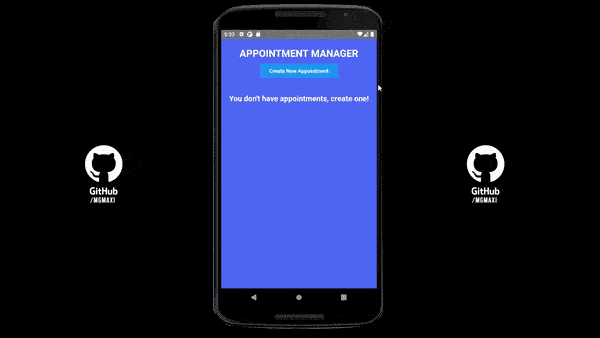

# <b> Medical Appointment Manager </b>

This is a project from the specialization program on mobile development of IBM & CaC.

## 📖 <b> About </b>

medicalAppointment is a medical appointment manager in which you can add appointments(patient, doctor, telephone, date, time, symptom) and manage them.

## 🛠️ <b> Technologies </b>

This project was created with(languages and libraries used):

- [React Native](https://reactnative.dev/)
- [React Native Modal Datetime Picker](https://github.com/mmazzarolo/react-native-modal-datetime-picker)
- [Momentjs](https://momentjs.com/)
- [AsyncStorage](https://github.com/react-native-async-storage/async-storage)

## 📷 <b> Preview </b>



## 🚀 <b> Setup / Launch</b>

### 🔧 <b>Local Installation</b>

```
git clone https://github.com/mgmaxi/medicalAppointment
cd ./medicalAppointment
npm install
```

### ⚙️ <b>Run it</b>

```
Android: "npx react-native run-android"
IOS: "npx react-native run-ios"
```
